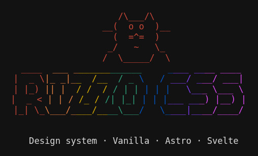

# Rizzo CSS

<div align="center">

<p align="center">
  
</p>

<!-- <div style="overflow-x: auto; max-width: 100%; min-width: 20em; -webkit-overflow-scrolling: touch; margin-top: 1em; margin-bottom: 1.5em;">
<pre style="font-family: ui-monospace, monospace; font-size: clamp(0.35em, 1.5vw, 0.85em); line-height: 1.2; margin: 0; display: inline-block; min-width: min-content;"><span style="color:#c44536 !important">      /\___/\   </span>
<span style="color:#c44536 !important">   __(  o o  )__</span>
<span style="color:#c44536 !important">     (  =^=  )  </span>
<span style="color:#c44536 !important">    _/   ~   \_ </span>
<span style="color:#c44536 !important">   /  \_____/  \</span>
<span style="color:#c44536 !important"> ____ </span><span style="color:#e07c3e !important"> ___ _</span><span style="color:#d4a800 !important">______</span><span style="color:#2d9d78 !important">______</span><span style="color:#0052bd !important">     _</span><span style="color:#7c3aed !important">___ __</span><span style="color:#d946ef !important">__ ____</span>
<span style="color:#c44536 !important">|  _ \</span><span style="color:#e07c3e !important">|_ _|_</span><span style="color:#d4a800 !important">_  /__</span><span style="color:#2d9d78 !important">  / _ </span><span style="color:#0052bd !important">\   / </span><span style="color:#7c3aed !important">___/ _</span><span style="color:#d946ef !important">__/ ___|</span>
<span style="color:#c44536 !important">| |_) </span><span style="color:#e07c3e !important">|| |  </span><span style="color:#d4a800 !important">/ /  /</span><span style="color:#2d9d78 !important"> / | |</span><span style="color:#0052bd !important"> | | |</span><span style="color:#7c3aed !important">   \__</span><span style="color:#d946ef !important">_ \___ \</span>
<span style="color:#c44536 !important">|  _ &lt;</span><span style="color:#e07c3e !important"> | | /</span><span style="color:#d4a800 !important"> /_ / </span><span style="color:#2d9d78 !important">/| |_|</span><span style="color:#0052bd !important"> | | |</span><span style="color:#7c3aed !important">___ __</span><span style="color:#d946ef !important">_) |__) |</span>
<span style="color:#c44536 !important">|_| \_</span><span style="color:#e07c3e !important">\___/_</span><span style="color:#d4a800 !important">___/__</span><span style="color:#2d9d78 !important">__\___</span><span style="color:#0052bd !important">/   \_</span><span style="color:#7c3aed !important">___|__</span><span style="color:#d946ef !important">__/____/</span><br><br>
  Design system · Vanilla · Astro · Svelte . React . Vue
</pre>
</div> -->

*Run `npx rizzo-css help` to see this in the CLI (rainbow uses our theme colors).*

<!-- Badges support light/dark mode via prefers-color-scheme -->
<a href="./LICENSE"><picture>
  <source srcset="https://img.shields.io/badge/License-MIT-yellow.svg?style=for-the-badge&theme=dark" media="(prefers-color-scheme: dark)" />
  <source srcset="https://img.shields.io/badge/License-MIT-yellow.svg?style=for-the-badge&theme=light" media="(prefers-color-scheme: light)" />
  
</picture></a>
<a href="https://www.npmjs.com/package/rizzo-css"><picture>
  <source srcset="https://img.shields.io/badge/npm-0.0.81-CB3837?style=for-the-badge&logo=npm&theme=dark" media="(prefers-color-scheme: dark)" />
  <source srcset="https://img.shields.io/badge/npm-0.0.81-CB3837?style=for-the-badge&logo=npm&theme=light" media="(prefers-color-scheme: light)" />
  
</picture></a>

**Frameworks** (same CSS & BEM for all)

<picture>
  <source srcset="https://img.shields.io/badge/Vanilla-JS%20%2F%20HTML5-F7DF1E?style=for-the-badge&logo=javascript&logoColor=black&theme=dark" media="(prefers-color-scheme: dark)" />
  <source srcset="https://img.shields.io/badge/Vanilla-JS%20%2F%20HTML5-F7DF1E?style=for-the-badge&logo=javascript&logoColor=black&theme=light" media="(prefers-color-scheme: light)" />
  
</picture>
<picture>
  <source srcset="https://img.shields.io/badge/Astro-5.17-FF5D01?style=for-the-badge&logo=astro&logoColor=white&theme=dark" media="(prefers-color-scheme: dark)" />
  <source srcset="https://img.shields.io/badge/Astro-5.17-FF5D01?style=for-the-badge&logo=astro&logoColor=white&theme=light" media="(prefers-color-scheme: light)" />
  
</picture>
<picture>
  <source srcset="https://img.shields.io/badge/Svelte-5.53+-FF3E00?style=for-the-badge&logo=svelte&logoColor=white&theme=dark" media="(prefers-color-scheme: dark)" />
  <source srcset="https://img.shields.io/badge/Svelte-5.53+-FF3E00?style=for-the-badge&logo=svelte&logoColor=white&theme=light" media="(prefers-color-scheme: light)" />
  
</picture>
<picture>
  <source srcset="https://img.shields.io/badge/React-19-61DAFB?style=for-the-badge&logo=react&logoColor=black&theme=dark" media="(prefers-color-scheme: dark)" />
  <source srcset="https://img.shields.io/badge/React-19-61DAFB?style=for-the-badge&logo=react&logoColor=black&theme=light" media="(prefers-color-scheme: light)" />
  
</picture>
<picture>
  <source srcset="https://img.shields.io/badge/Vue-3.5-4FC08D?style=for-the-badge&logo=vue.js&logoColor=white&theme=dark" media="(prefers-color-scheme: dark)" />
  <source srcset="https://img.shields.io/badge/Vue-3.5-4FC08D?style=for-the-badge&logo=vue.js&logoColor=white&theme=light" media="(prefers-color-scheme: light)" />
  
</picture>

**Tooling**

<picture>
  <source srcset="https://img.shields.io/badge/TypeScript-5.9-3178C6?style=for-the-badge&logo=typescript&logoColor=white&theme=dark" media="(prefers-color-scheme: dark)" />
  <source srcset="https://img.shields.io/badge/TypeScript-5.9-3178C6?style=for-the-badge&logo=typescript&logoColor=white&theme=light" media="(prefers-color-scheme: light)" />
  
</picture>
<picture>
  <source srcset="https://img.shields.io/badge/Node.js-18+-339933?style=for-the-badge&logo=node.js&logoColor=white&theme=dark" media="(prefers-color-scheme: dark)" />
  <source srcset="https://img.shields.io/badge/Node.js-18+-339933?style=for-the-badge&logo=node.js&logoColor=white&theme=light" media="(prefers-color-scheme: light)" />
  
</picture>
<picture>
  <source srcset="https://img.shields.io/badge/Vite-6+-646CFF?style=for-the-badge&logo=vite&logoColor=white&theme=dark" media="(prefers-color-scheme: dark)" />
  <source srcset="https://img.shields.io/badge/Vite-6+-646CFF?style=for-the-badge&logo=vite&logoColor=white&theme=light" media="(prefers-color-scheme: light)" />
  
</picture>
<picture>
  <source srcset="https://img.shields.io/badge/PostCSS-8.5-DD3A0A?style=for-the-badge&logo=postcss&logoColor=white&theme=dark" media="(prefers-color-scheme: dark)" />
  <source srcset="https://img.shields.io/badge/PostCSS-8.5-DD3A0A?style=for-the-badge&logo=postcss&logoColor=white&theme=light" media="(prefers-color-scheme: light)" />
  
</picture>
<picture>
  <source srcset="https://img.shields.io/badge/Stylelint-17-263238?style=for-the-badge&logo=stylelint&logoColor=white&theme=dark" media="(prefers-color-scheme: dark)" />
  <source srcset="https://img.shields.io/badge/Stylelint-17-263238?style=for-the-badge&logo=stylelint&logoColor=white&theme=light" media="(prefers-color-scheme: light)" />
  
</picture>
<picture>
  <source srcset="https://img.shields.io/badge/pnpm-9+-F69220?style=for-the-badge&logo=pnpm&logoColor=white&theme=dark" media="(prefers-color-scheme: dark)" />
  <source srcset="https://img.shields.io/badge/pnpm-9+-F69220?style=for-the-badge&logo=pnpm&logoColor=white&theme=light" media="(prefers-color-scheme: light)" />
  
</picture>
<picture>
  <source srcset="https://img.shields.io/badge/Husky-9-8F8F8F?style=for-the-badge&logo=husky&logoColor=white&theme=dark" media="(prefers-color-scheme: dark)" />
  <source srcset="https://img.shields.io/badge/Husky-9-8F8F8F?style=for-the-badge&logo=husky&logoColor=white&theme=light" media="(prefers-color-scheme: light)" />
  
</picture>
<picture>
  <source srcset="https://img.shields.io/badge/Playwright-1.49-2D4552?style=for-the-badge&logo=playwright&logoColor=white&theme=dark" media="(prefers-color-scheme: dark)" />
  <source srcset="https://img.shields.io/badge/Playwright-1.49-2D4552?style=for-the-badge&logo=playwright&logoColor=white&theme=light" media="(prefers-color-scheme: light)" />
  
</picture>
<picture>
  <source srcset="https://img.shields.io/badge/Storybook-10-FF4785?style=for-the-badge&logo=storybook&logoColor=white&theme=dark" media="(prefers-color-scheme: dark)" />
  <source srcset="https://img.shields.io/badge/Storybook-10-FF4785?style=for-the-badge&logo=storybook&logoColor=white&theme=light" media="(prefers-color-scheme: light)" />
  
</picture>
<picture>
  <source srcset="https://img.shields.io/badge/axe--core-4.10-007DC2?style=for-the-badge&logo=accessibility&logoColor=white&theme=dark" media="(prefers-color-scheme: dark)" />
  <source srcset="https://img.shields.io/badge/axe--core-4.10-007DC2?style=for-the-badge&logo=accessibility&logoColor=white&theme=light" media="(prefers-color-scheme: light)" />
  
</picture>
<picture>
  <source srcset="https://img.shields.io/badge/Algolia-5.47-5468FF?style=for-the-badge&logo=algolia&logoColor=white&theme=dark" media="(prefers-color-scheme: dark)" />
  <source srcset="https://img.shields.io/badge/Algolia-5.47-5468FF?style=for-the-badge&logo=algolia&logoColor=white&theme=light" media="(prefers-color-scheme: light)" />
  
</picture>
<picture>
  <source srcset="https://img.shields.io/badge/lint--staged-15-4A90D9?style=for-the-badge&logo=git&logoColor=white&theme=dark" media="(prefers-color-scheme: dark)" />
  <source srcset="https://img.shields.io/badge/lint--staged-15-4A90D9?style=for-the-badge&logo=git&logoColor=white&theme=light" media="(prefers-color-scheme: light)" />
  
</picture>
<picture>
  <source srcset="https://img.shields.io/badge/GitHub_Actions-a11y%20%7C%20build-2088FF?style=for-the-badge&logo=github-actions&logoColor=white&theme=dark" media="(prefers-color-scheme: dark)" />
  <source srcset="https://img.shields.io/badge/GitHub_Actions-a11y%20%7C%20build-2088FF?style=for-the-badge&logo=github-actions&logoColor=white&theme=light" media="(prefers-color-scheme: light)" />
  
</picture>

A modern CSS design system with semantic theming and 58 accessible components. **Vanilla**, **Astro**, **Svelte**, **React**, and **Vue** — same CSS and BEM; docs and CLI for all five.

[Getting Started](#-getting-started) • [Documentation](#-documentation) • [Components](#-components) • [Theming](#-theming-system)

</div>

---

## ✨ Features

- 🎨 **14 Built-in Themes** - 7 dark and 7 light themes with semantic variable support (including GitHub Dark Classic and GitHub Light)
- ♿ **Accessibility First** - WCAG AA compliant with full keyboard navigation and screen reader support
- 🎯 **Semantic Theming** - All components use semantic CSS variables that adapt automatically
- 📦 **Comprehensive Components** - 58 accessible, themeable components (Astro reference + Svelte + React + Vue + Vanilla docs)
- 🔀 **Multi-framework** - **Vanilla JS**, Astro, Svelte, and **React** with the same CSS and BEM; **all 58 components have full React implementations** with working live demos and React/TSX code blocks. Every component doc page shows **Usage tabs (Astro | Vanilla | Svelte | Vue | React)** with up-to-date copy-paste examples. CLI offers Vanilla, Astro, Svelte, React, and Vue scaffolds. Framework switcher: **View as: Astro | Vanilla | Svelte | Vue | React**. [/docs/svelte](/docs/svelte) · [/docs/react](/docs/react) · [/docs/vue](/docs/vue) · [/docs/vanilla](/docs/vanilla)
- 🛠️ **Utility Classes** - Display, position, borders, flexbox, grid, gap, animations, and more
- 🎨 **OKLCH Colors** - Perceptually uniform color space for better color manipulation
- 📱 **Responsive** - Mobile-first design with responsive breakpoints
- ⚡ **Optimized** - PostCSS processing with minification and vendor prefixes
- 🎯 **Design System as Source of Truth** - 165+ CSS variables ensure all styling is consistent and framework-portable

## 🛠️ Tech Stack

**Frameworks (docs + components)** — same CSS and BEM for all; CLI scaffolds for each.

- **Vanilla JS / HTML5** - No framework; use the CSS and copy HTML from [Vanilla docs](/docs/vanilla/components) or the CLI scaffold.
- **[Astro](https://astro.build)** `5.17` - Docs site and reference components; [@astrojs/react](https://docs.astro.build/en/guides/integrations-guide/react/) and [@astrojs/vue](https://docs.astro.build/en/guides/integrations-guide/vue/) for component islands.
- **[Svelte](https://svelte.dev)** `5.53+` - Components and docs at /docs/svelte; Svelte Kit scaffold.
- **[React](https://react.dev)** `19` - Components and docs at /docs/react; Vite + React scaffold.
- **[Vue](https://vuejs.org)** `3.5` - Components and docs at /docs/vue; Vite + Vue scaffold.

**Build & tooling**

- **[Vite](https://vitejs.dev)** `6+` - Build tool (Svelte/React/Vue scaffolds, Astro under the hood)
- **[TypeScript](https://www.typescriptlang.org/)** `5.9` - Type safety
- **[PostCSS](https://postcss.org/)** `8.5` - CSS pipeline with [postcss-import](https://github.com/postcss/postcss-import), [Autoprefixer](https://github.com/postcss/autoprefixer), [cssnano](https://cssnano.co/)
- **[Stylelint](https://stylelint.io/)** `17` - CSS linting
- **[Husky](https://typicode.github.io/husky/)** `9` - Git hooks (pre-commit: lint-staged, pre-push: build + smoke)
- **[Playwright](https://playwright.dev)** `1.49` - Accessibility and smoke tests
- **[axe-core](https://github.com/dequelabs/axe-core)** `4.10` - Accessibility rules (via @axe-core/playwright)
- **[Storybook](https://storybook.js.org)** `10` - React component playground (optional)
- **[Algolia](https://www.algolia.com/)** `5.47` - Search (docs site, optional)
- **OKLCH** - Perceptually uniform color space (themes; [culori](https://culorijs.org/) for format generation)

## 🚀 Getting Started

**Using Rizzo?** `npx rizzo-css init` — choose **framework** (Vanilla, Astro, Svelte, React, or Vue), then **add to existing** or **create new**. Both use the **same template choice**: **CSS only** (stylesheet + license, README, .gitignore; no web pages or components), **Landing** (hero/features), **Docs** (sidebar + sample doc), **Dashboard** (sidebar + stats/table), or **Full** (clone of the docs site). We never overwrite; snippets go in RIZZO-SETUP.md. **Add** is for existing projects: run in your project root, choose template, then select which components to add (or CSS only). Non-interactive: `npx rizzo-css init --yes --framework vanilla|astro|svelte|react|vue --template css-only|landing|docs|dashboard|full` or `npx rizzo-css add --template css-only|landing|docs|dashboard|full`. Or install the package: `pnpm add rizzo-css` (or npm/yarn/bun). To run the CLI: use the [docs site](https://rizzo-css.vercel.app/docs/getting-started) package manager tabs (npm, pnpm, yarn, bun)—the **yarn** tab shows `npx` so it works with Yarn 1 and 2+. Optional **rizzo-css.json** for targetDir, framework, packageManager. Full guide: [GETTING_STARTED](docs/GETTING_STARTED.md). React and Vue: same CSS; full docs with live examples and code blocks at /docs/react and /docs/vue.

**What ships:** `rizzo-css` includes dist, CLI, and scaffolds (vanilla; astro/base + astro/variants + astro components; svelte/base + svelte/variants + svelte components; react; vue). Every scaffold includes **LICENSE-RIZZO**, **README-RIZZO.md**, and **.gitignore**; Astro/Svelte include package.json and .env.example. **CLI:** `init` | `add` | `theme` | `doctor` | `help`. **New and existing use the same flow:** choose **CSS only** | **Landing** | **Docs** | **Dashboard** | **Full**. CSS only = no web pages or components (stylesheet + license, README, .gitignore). **Add** is for existing projects: run in project root, then select components (or CSS only). Landing/Docs/Dashboard = component picker (all 58 or pick); Full = site clone. Dependencies auto-included (Navbar→Search, Settings; Settings→ThemeSwitcher, FontSwitcher, SoundEffects; Toast→Alert). Full also writes **RIZZO-SNIPPET.txt** unless `--no-snippet`. You add the `<link>` (CLI prints it). Run `npx rizzo-css help components` for the list. Same CSS and BEM for all five frameworks.

### Prerequisites

- Node.js 18+
- pnpm (recommended) or npm

### Installation (this repo)

```bash
pnpm install
```

### Development

```bash
pnpm dev
```

Site available at `http://localhost:4321`

## 📜 Commands

| Command | Description |
|---------|-------------|
| `pnpm rizzo-css` | Run the CLI from this repo (e.g. `pnpm rizzo-css init`, `pnpm rizzo-css add`, `pnpm rizzo-css theme`). Elsewhere use `npx rizzo-css`. |
| `pnpm dev` | Start development server |
| `pnpm build` | Lint CSS, build minified CSS, and build the docs site (Astro). Use for preview/deploy. |
| `pnpm build:css` | Build minified CSS only → `public/css/main.min.css` and `packages/rizzo-css/dist/rizzo.min.css` |
| `pnpm build:package` | Full package prep: lint, build CSS, copy scaffold, run prepare-* scripts. Use before `publish:package`. |
| `pnpm publish:package` | Run `build:package` then publish the `rizzo-css` npm package |
| `pnpm preview` | Preview production build |
| `pnpm storybook` | Build CSS and start Storybook for React components (port 6006). See [docs/STORYBOOK.md](docs/STORYBOOK.md). |
| `pnpm lint:css` | Lint CSS files |
| `pnpm lint:css:fix` | Auto-fix CSS linting issues |
| `pnpm test:a11y` | Build site and run accessibility tests (axe, keyboard, ARIA) on all docs routes. See [docs/TESTING.md](docs/TESTING.md). |
| `pnpm test:a11y:fast` | Same as `test:a11y` but axe runs on a subset of routes (~25) for faster local feedback. |
| `pnpm test:a11y:ci` | Install Chromium and run a11y tests (for CI). |
| `pnpm test:a11y:ci:cross-browser` | Run a11y tests on Chromium, Firefox, and WebKit (same as CI). See [BROWSER_SUPPORT](docs/BROWSER_SUPPORT.md#testing). |
| `pnpm check:size` | Build CSS and fail if package bundle exceeds 450 kB (CI runs this). See [CONTRIBUTING](CONTRIBUTING.md#bundle-size). |
| `pnpm test:smoke` | Build and run smoke tests (key routes: home, docs, blocks, themes, React/Vue doc index). Pre-push hook runs this. See [docs/TESTING.md](docs/TESTING.md) and [CONTRIBUTING](CONTRIBUTING.md). |
| `pnpm test:visual` | Build and run visual regression tests (screenshots of key routes). Update baselines: `pnpm test:visual:update`. See [docs/TESTING.md](docs/TESTING.md). |
| `pnpm export:tokens` | Export design tokens to `public/tokens/rizzo-tokens.json` and `.js` from `ai/design-tokens.json`. Runs as part of `pnpm build`. |

## 🎨 CSS Setup

### Imports

Use PostCSS imports (similar to SCSS/SASS) in `src/styles/main.css`:

```css
@import url('./variables.css');
@import url('./reset.css');
@import url('./base.css');
@import url('./typography.css');
@import url('./accessibility.css');
/* ... */
```

### Processing Pipeline

**Development:**
- PostCSS processes imports and adds vendor prefixes
- Source CSS is used directly
- All 14 themes are available

**Production:**
- CSS is minified and optimized via `build:css` script
- Layout automatically uses `public/css/main.min.css` in production builds
- Minification preserves pseudo-element syntax (`::before`, `::after`)

### CSS Architecture

CSS is organized into logical files (variables, reset, base, typography, components, themes, etc.). All components use **BEM** naming (e.g. `.navbar`, `.navbar__container`, `.navbar__menu--open`). See [Design System](./docs/DESIGN_SYSTEM.md) for the full file list and variable reference.

### Theming System

Rizzo CSS includes **14 built-in themes** (7 dark, 7 light) with semantic variable support:

- All components automatically adapt to the selected theme
- Themes use OKLCH color format for better color manipulation
- **Contrast-aware text colors** - Automatic text color selection based on background lightness for WCAG AA compliance
- **System preference** - First visit uses OS light/dark (`prefers-color-scheme`); “System” option in the theme switcher follows OS and updates when the OS preference changes
- **Unique theme icons** - Each theme has a distinct icon in the theme switcher (Owl, Palette, Flame, Sunset, Zap, Shield, Heart, Sun, Cake, Lemon, Rainbow, Leaf, Cherry, Brush)
- Settings panel for theme switching, font size adjustment, and accessibility options
- **All settings persist in localStorage** - Theme (including `system`), font size, reduced motion, high contrast, and scrollbar style preferences are automatically saved and restored
- Shadow and overlay variables for theme-aware effects

See [Theming Documentation](./docs/THEMING.md) for details.

### Components

Accessible, themeable components:
- **Navbar** - Responsive navigation with **flat links** (no dropdowns): **Docs** | **Components** | **Blocks** | **Themes** | **Colors**. Logo links to home; Search and Settings in the desktop actions area. Default Cat logo in the brand link (optional `logo` prop for custom image). Mobile: hamburger menu with the same top-level links; menu toggle, search, and settings with smooth transitions
- **Settings** - Settings panel with theme switcher, font size, font pair switcher (same UI as theme: trigger + menu + preview; six pairs: Geist, Inter + JetBrains Mono, IBM Plex Sans + Mono, Source Sans 3 + Source Code Pro, DM Sans + DM Mono, Outfit + JetBrains Mono), and accessibility options (reduce motion, high contrast, scrollbar style). All settings persist in localStorage. Close button (X) bordered and visible on hover. Opening/closing animations, mobile responsive
- **ThemeSwitcher** - Accessible dropdown with **System** option (follows OS light/dark), Preference + Dark/Light groups, theme-specific icons, and active state styling. Preview panel shows current theme by default and hovered theme on hover. All theme switchers (Settings, docs) use the same full-width trigger and dropdown.
- **Button** - Semantic button component with variants using theme variables
- **Badge** - Small labels and tags for displaying status, categories, or counts with variants, sizes, and pill option
- **Icons** - Reusable SVG icon components using Tabler Icons and Devicons (same set for Astro, Svelte, React, Vue, and Vanilla): 30 regular icons (Tabler) and 22 devicons (brand icons for CSS3, HTML5, JavaScript, Node.js, Astro, Svelte, React, Vue, and more; includes Cat logo and Cmd icon for keyboard shortcuts)
- **Form Components** - Complete form system (FormGroup, Input, Textarea, Select, Checkbox, Radio) with validation states
- **Card** - Flexible card component with variants, sections, and image support
- **Modal** - Accessible modal/dialog component with focus trapping and keyboard navigation. Three sizes: sm, md (default), lg
- **CopyToClipboard** - Copy to clipboard component with visual feedback
- **CodeBlock** - Code block component with integrated copy-to-clipboard functionality and language icons. Displays colored brand icons (Devicons) for supported languages at 20px size for better visibility. Language text appears on large screens, icons only on mobile. Icons and copy button are vertically centered on all screen sizes. Used throughout documentation for code examples
- **Search** - Search component with Algolia integration; trigger uses Cmd icon and K at same size as search icon (20px); Cmd+K/Ctrl+K toggles open/close (including when focus is in search), Escape closes, backdrop or X to close; same live standalone example on Astro, Svelte, React, Vue, and Vanilla doc pages; mobile responsive
- **Alert** - Alert/notification component with variants, dismissible functionality, auto-dismiss, and dynamic creation via JavaScript
- **Toast** - Fixed position toast notifications with auto-dismiss and programmatic control. Available globally via `window.showToast()`. Six position options with automatic stacking
- **Tooltip** - Accessible tooltip component with four position options (top, bottom, left, right), keyboard support, and theme-aware styling
- **Dropdown** - Accessible dropdown menu component with keyboard navigation, nested submenus (up to 3 levels), menu items, separators, and custom click handlers
- **Tabs** - Accessible tabs component with keyboard navigation, ARIA tab pattern, and three variants (default, pills, underline)

All components:
- Use semantic theme variables with contrast-aware text colors
- Are fully keyboard accessible
- Have no inline styles (all CSS in external files)
- Follow BEM naming convention
- Include theme flash prevention on page load (inline script in Layout)
- Meet WCAG AA contrast requirements
- Theme switcher displays active theme name and icon in trigger button
- Individual documentation pages with live examples

See [Components Documentation](./docs/COMPONENTS.md) for usage examples.

## 📚 Documentation

**Live site:** [rizzo-css.vercel.app](https://rizzo-css.vercel.app)

Comprehensive documentation is in the `docs/` directory and on the live site. **Site nav:** **Docs** | **Components** | **Blocks** | **Themes** | **Colors** (flat links; logo links to home). Docs sidebar: Introduction, Foundations, Components, Examples. **Site pages:** [Tokens reference](https://rizzo-css.vercel.app/docs/tokens), [Examples](https://rizzo-css.vercel.app/docs/examples) (form layouts, dashboard stats, settings panels). Blocks: pre-built layouts at `/blocks`.

- [Getting Started](./docs/GETTING_STARTED.md) - CLI (`npx rizzo-css init`/`add`), npm install, import CSS, use components (Astro/Svelte/React/Vue/Vanilla), [JavaScript utilities](./docs/GETTING_STARTED.md#javascript-utilities) (theme, storage, clipboard, toast), and [docs layout / site nav](./docs/GETTING_STARTED.md#documentation-layout-and-site-nav)
- [Design System](./docs/DESIGN_SYSTEM.md) - Variables, file organization, and utilities
- [Components](./docs/COMPONENTS.md) - Component library and usage (58 components)
- [Theming](./docs/THEMING.md) - Themes, system preference, custom themes (also linked under Docs → Foundations on the site)
- [Colors](./docs/COLORS.md) - Color reference (OKLCH, Hex, RGB, HSL)
- [Accessibility](./docs/ACCESSIBILITY.md) - Guidelines, utility classes, best practices, and manual accessibility testing (keyboard, screen reader, tools)
- [Framework Structure](./docs/FRAMEWORK_STRUCTURE.md) - Astro vs Svelte layout; framework switcher
- [Multi-Framework Strategy](./docs/MULTI_FRAMEWORK.md) - Vanilla, Astro, Svelte, React, Vue (same CSS; docs and scaffolds for all five)
- [Publishing](./docs/PUBLISHING.md) - How to publish the npm package
- [Changelog](./CHANGELOG.md) - Package and design system releases
- [TODO](./docs/TODO.md) - Roadmap and tasks

## 📚 External Resources

- [Astro Documentation](https://docs.astro.build)
- [PostCSS Documentation](https://postcss.org/docs)
- [Stylelint Documentation](https://stylelint.io/user-guide)
